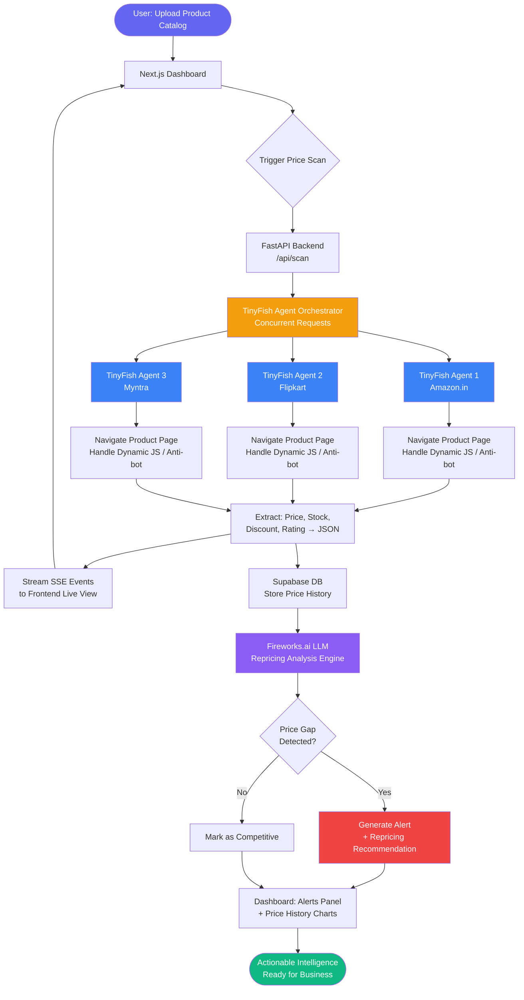

# AutoOps — E-commerce Price Intelligence Agent

> **Powered by [TinyFish Web Agent API](https://tinyfish.ai) · Built for TinyFish $2M Pre-Accelerator Hackathon**

AutoOps is an autonomous web agent that monitors competitor prices across live e-commerce platforms in real-time and delivers actionable repricing intelligence — no manual browsing, no brittle scrapers, no stale data.

**The problem it solves:** E-commerce businesses waste 5–10 hours/week manually checking competitor prices on Amazon, Flipkart, and Myntra. AutoOps eliminates this entirely. Give the agent your product catalog and target platforms — it navigates live product pages, extracts current prices, detects price drops and stock changes, and surfaces a repricing recommendation dashboard. All autonomously.

---

## What AutoOps Does

1. **Ingests** your product catalog (name, your current price, target margin)
2. **Deploys TinyFish Web Agents concurrently** to navigate Amazon.in, Flipkart, and Myntra
3. **Extracts live prices**, discounts, ratings, and stock status from each platform
4. **Scores repricing opportunities** using an LLM-powered analysis engine
5. **Streams results live** to a Next.js dashboard with real-time agent activity preview
6. **Alerts** when competitor prices drop below your threshold

---

## Tech Stack

| Layer | Technology | Purpose |
|---|---|---|
| **Web Agent** | [TinyFish API](https://docs.tinyfish.ai) | Live browser automation across e-commerce sites |
| **Frontend** | Next.js 14 + Tailwind CSS | Dashboard UI, live SSE stream display |
| **UI Scaffolding** | v0 by Vercel | Rapid component generation |
| **Backend** | Python (FastAPI) | API orchestration, agent job queue |
| **LLM / Analysis** | Fireworks.ai (Llama 3.3 70B) | Repricing recommendation engine |
| **Database** | Supabase (PostgreSQL) | Product catalog, price history, alerts |
| **Real-time** | Server-Sent Events (SSE) | Live agent progress streaming to frontend |
| **Deployment** | Railway | Backend + frontend hosting |
| **Monitoring** | AgentOps | Agent run observability and debugging |

---

## Project Structure

```
autoops/
├── frontend/                  # Next.js dashboard
│   ├── app/
│   │   ├── page.tsx           # Main dashboard
│   │   ├── api/
│   │   │   ├── scan/route.ts  # Trigger agent scan
│   │   │   └── stream/route.ts# SSE proxy to FastAPI
│   │   └── components/
│   │       ├── ProductTable.tsx
│   │       ├── AgentLiveView.tsx
│   │       ├── PriceHistoryChart.tsx
│   │       └── AlertBanner.tsx
│   └── package.json
│
├── backend/                   # FastAPI Python backend
│   ├── main.py                # FastAPI app + routes
│   ├── agent/
│   │   ├── tinyfish_client.py # TinyFish API wrapper
│   │   ├── scraper.py         # Concurrent multi-platform scraping
│   │   └── goals.py           # TinyFish goal prompt templates
│   ├── analysis/
│   │   ├── pricing_engine.py  # Fireworks.ai LLM repricing logic
│   │   └── alert_engine.py    # Threshold-based alert system
│   ├── db/
│   │   ├── supabase_client.py
│   │   └── schema.sql
│   └── requirements.txt
│
├── .env.example
├── README.md
└── docker-compose.yml
```

---

## Development Flow



---

## Core TinyFish Integration

The agent uses **Concurrent Requests** to scan all platforms in parallel — cutting scan time from minutes to seconds:

```python
# backend/agent/scraper.py
import asyncio
from tinyfish import TinyFish
from .goals import build_price_extraction_goal

client = TinyFish()  # TINYFISH_API_KEY from env

PLATFORMS = {
    "amazon": "https://www.amazon.in/s?k={query}",
    "flipkart": "https://www.flipkart.com/search?q={query}",
    "myntra": "https://www.myntra.com/{query}",
}

async def scan_product_across_platforms(product_name: str, yield_event):
    tasks = []
    for platform, url_template in PLATFORMS.items():
        url = url_template.format(query=product_name.replace(" ", "+"))
        goal = build_price_extraction_goal(product_name, platform)
        tasks.append(run_agent_stream(url, goal, platform, yield_event))

    results = await asyncio.gather(*tasks, return_exceptions=True)
    return results

async def run_agent_stream(url: str, goal: str, platform: str, yield_event):
    with client.agent.stream(
        url=url,
        goal=goal,
        browser_profile="stealth",  # Anti-bot mode for Amazon/Flipkart
    ) as stream:
        for event in stream:
            await yield_event({"platform": platform, "event": event})
    return event.get("result")
```

---

## Getting Started

### Prerequisites
- Python 3.11+
- Node.js 18+
- TinyFish API Key → [tinyfish.ai](https://tinyfish.ai)
- Supabase project → [supabase.com](https://supabase.com)
- Fireworks.ai API Key → [fireworks.ai](https://fireworks.ai)

### Setup

```bash
# Clone the repo
git clone https://github.com/YOUR_USERNAME/autoops-price-agent.git
cd autoops-price-agent

# Backend
cd backend
pip install -r requirements.txt
cp ../.env.example .env   # Fill in API keys
uvicorn main:app --reload

# Frontend (new terminal)
cd frontend
npm install
npm run dev
```

### Environment Variables

```env
TINYFISH_API_KEY=your_tinyfish_api_key
SUPABASE_URL=your_supabase_url
SUPABASE_KEY=your_supabase_anon_key
FIREWORKS_API_KEY=your_fireworks_api_key
```

---

## Hackathon Submission

- **Hackathon:** TinyFish $2M Pre-Accelerator Hackathon on HackerEarth
- **Theme:** Build an autonomous web agent using the TinyFish API
- **Demo Video:** [Link to X post]
- **Live App:** [Railway deployment URL]

---

## Roadmap (Post-Hackathon)

- [ ] Add Meesho, JioMart, and Nykaa as additional platforms
- [ ] Scheduled auto-scans (daily/hourly via cron)
- [ ] Email/WhatsApp alerts for price drops
- [ ] Multi-user SaaS with team workspaces
- [ ] Shopify / WooCommerce integration for auto-repricing
- [ ] Platform expansion → AutoOps for HR, Legal, Finance workflows

---

## License

MIT © 2026 AutoOps

---

*Built with ❤️ using TinyFish — the infrastructure that makes the web executable for AI agents.*
